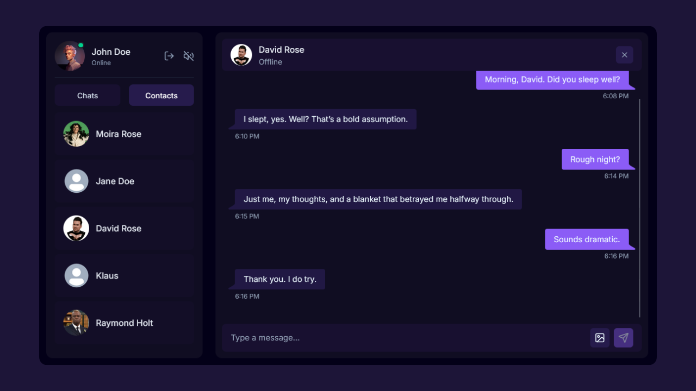

# Convo – Real-Time Chat App



A full-featured, real-time chat application built with the **MERN stack** and **Socket.io**, designed for seamless communication with a modern, beautiful UI.

## ✨ Highlights

🔑 JWT Authentication | 💬 Real-time Messaging | 👀 Online/Offline Status

🎵 Notification & Typing Sounds | ✉️ Welcome Emails | 🖼️ Image Uploads

🛠️ REST API + MongoDB | 🛡️ Rate-limiting & Bot Protection | 🖌️ Modern UI | 🔄 Zustand State Management

## 🛠️ Tech Stack

- **Frontend:** React, Tailwind CSS, DaisyUI
- **Backend:** Node.js, Express.js, Socket.io
- **Database:** MongoDB
- **State Management:** Zustand
- **File Storage:** Cloudinary
- **Email Service:** Resend
- **Security:** JWT Authentication, Arcjet rate-limiting

## ⚡ Features

- Register and log in securely using JWT authentication
- Chat with other users in real-time
- See who is online or offline
- Get typing notifications and optional sounds
- Upload and share images in chat
- Receive welcome emails automatically after signup
- Robust backend API with rate-limiting and bot protection

## 🚀 Installation

**Clone the repository**

```bash
git clone https://github.com/yourusername/convo.git
cd convo
```

**Setup environment variables**

Create a .env file in the backend directory and add:

```bash
PORT=3000
MONGO_URI=your_mongo_uri_here

NODE_ENV=development

JWT_SECRET=your_jwt_secret

RESEND_API_KEY=your_resend_api_key
EMAIL_FROM=your_email_from_address
EMAIL_FROM_NAME=your_email_from_name

CLIENT_URL=http://localhost:5173

CLOUDINARY_CLOUD_NAME=your_cloudinary_cloud_name
CLOUDINARY_API_KEY=your_cloudinary_api_key
CLOUDINARY_API_SECRET=your_cloudinary_api_secret

ARCJET_KEY=your_arcjet_key
ARCJET_ENV=development
```

Install dependencies and start the app

```bash
# Backend
cd backend
npm install
npm run dev

# Frontend
cd frontend
npm install
npm run dev
```
